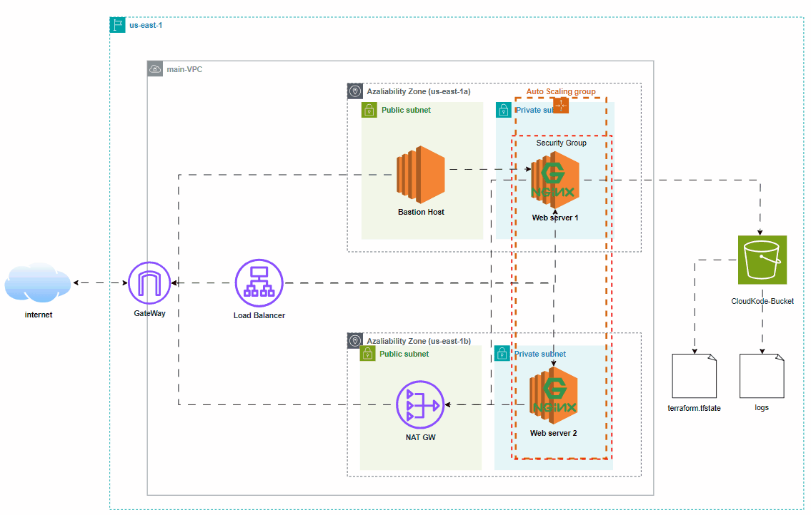

# CloudKode Project - AWS Infrastructure with Terraform

This project automates the creation of a scalable and secure AWS infrastructure using Terraform. It provisions a Virtual Private Cloud (VPC), subnets, S3 buckets, security groups, EC2 instances, an Application Load Balancer (ALB), and an Auto Scaling Group (ASG). The setup is highly modular and deploys resources across multiple availability zones in the `us-east-1` region.

## Overview

The **CloudKode Project** is designed to create a scalable and secure AWS infrastructure using Terraform. This project sets up a Virtual Private Cloud (VPC), subnets, security groups, an Auto Scaling Group (ASG), an Application Load Balancer (ALB), and other resources to host a web application in the AWS cloud.

### Features

- **VPC and Subnets**: Creates a main VPC with public and private subnets.
- **Security Groups**: Configures security groups to manage access to resources.
- **Auto Scaling Group**: Sets up an ASG with EC2 instances to ensure high availability.
- **Load Balancer**: Implements an ALB to distribute incoming traffic to the instances.
- **State Management**: Uses S3 for state storage and DynamoDB for state locking to ensure safe deployments.

## Project Structure

- **backend.tf**: Configures Terraform to store the state file in an S3 bucket.
- **provider.tf**: Defines the AWS provider configuration.
- **variable.tf**: Declares input variables used across the Terraform configurations.
- **terraform.tfvars**: Specifies values for input variables.
- **s3-bucket.tf**: Provisions an S3 bucket.
- **vpc.tf**: Creates the VPC and subnets (public and private) across different availability zones.
- **route_tables.tf**: Sets up public and private route tables.
- **nagw.tf**: Configures the NAT Gateway and Elastic IP for routing outbound traffic from private subnets.
- **iam_role.tf**: Creates IAM roles and policies for EC2 instances with access to S3.
- **sg.tf**: Provisions security groups for HTTP, SSH access, and bastion hosts.
- **ec2_bastion.tf**: Provisions a bastion host for secure SSH access.
- **load_balancer.tf**: Configures an Application Load Balancer (ALB) and its associated target group and listener.
- **auto_scalling_group.tf**: Sets up an Auto Scaling Group and Launch Configuration for automatically scaling EC2 instances.
- **rsa_private_key.tf**: Generates an RSA private key and creates an EC2 Key Pair.
- **output.tf**: Outputs the IDs and CIDR blocks of the created subnets and resources.

## Prerequisites

To run this project, you need the following:
- [Terraform](https://www.terraform.io/downloads.html) installed.
- AWS credentials configured .
- An AWS account with permissions to create resources such as VPCs, EC2, and IAM.
