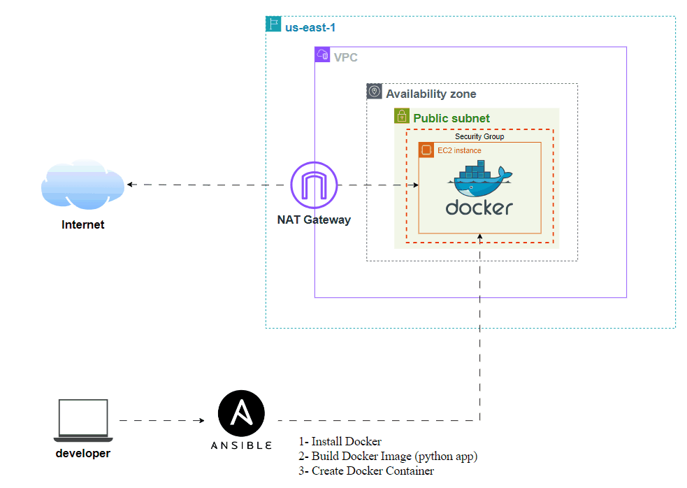

# EC2 AutoDeploy: Docker on AWS with Ansible & Terraform

**EC2 AutoDeploy** is a streamlined automation solution designed to provision an AWS EC2 instance and deploy a Dockerized application efficiently. This project leverages Terraform to manage infrastructure as code, enabling the creation of cloud resources with ease and repeatability. Using Ansible, it automates the installation of Docker, builds the application image from a specified Dockerfile, and runs the container on the newly created EC2 instance.

This end-to-end setup provides a scalable and reproducible environment for deploying applications, making it ideal for developers and DevOps engineers looking to enhance their cloud deployment workflows.

## Project Overview

- **Terraform**: Used to create an EC2 instance and copy files to the server.
- **Ansible**: Used to configure the EC2 instance by installing Docker, building a Docker image, and running a container with the uploaded app.

## Prerequisites

Make sure you have the following tools installed locally:

- **Terraform** (>= 1.0)
- **Ansible** (>= 2.9)
- **AWS CLI** (configured with appropriate permissions)
- **SSH Key**: You must have an SSH key pair for accessing the EC2 instance.
