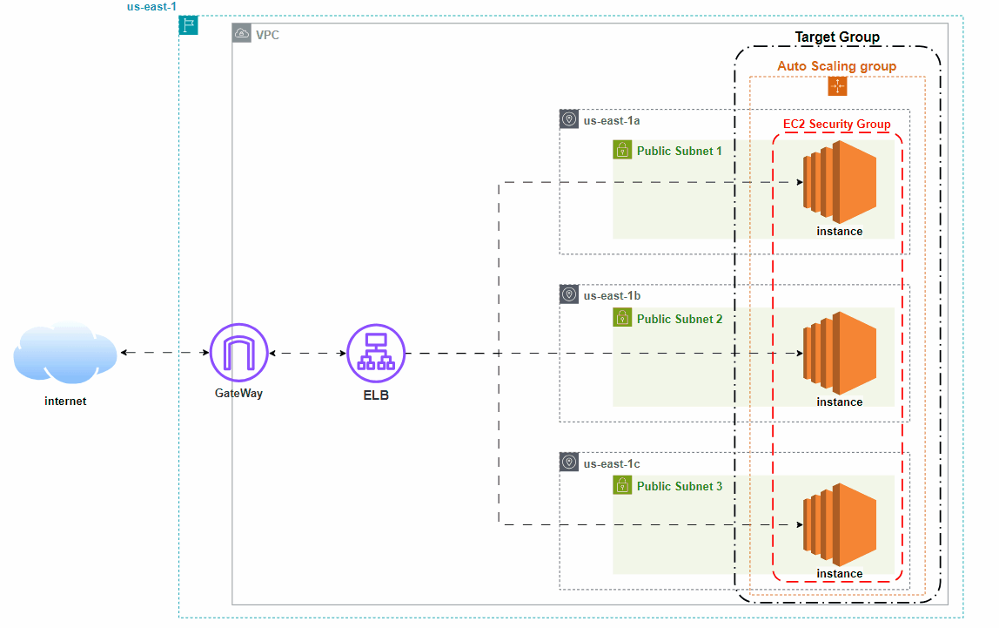

# Scalable AWS Infrastructure with Terraform 🚀

This project demonstrates how to build a scalable, highly available, and reliable infrastructure on AWS using Terraform. The infrastructure automatically adjusts to traffic demands, balancing the load across multiple instances while ensuring smooth operations.

## 🛠️ Project Overview

The main objective of this project is to create an AWS infrastructure that can scale automatically based on demand. This includes setting up a VPC, deploying multiple EC2 instances running Nginx, configuring load balancing, and automating scaling through an Auto Scaling Group. Terraform is used as Infrastructure as Code (IaC) to automate and manage the entire setup.

## 📋 Features

- **VPC**: A Virtual Private Cloud (VPC) with 3 public subnets, each in a different availability zone for redundancy and fault tolerance.
- **EC2 Instances**: 3 EC2 instances (t3.micro, Ubuntu) are deployed across the subnets. Nginx is installed and customized to display the instance responding to the requests.
- **Auto Scaling Group**: An Auto Scaling Group is configured to maintain a minimum of 2 instances and scale up to 4 instances as traffic increases.
- **Application Load Balancer (ALB)**: The ALB distributes incoming traffic evenly across the instances for better availability and responsiveness.
- **Terraform State Management**: The Terraform state is stored securely in S3, with state locking and consistency managed by DynamoDB.
